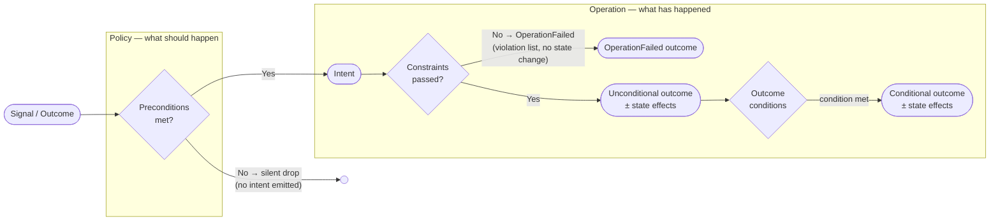
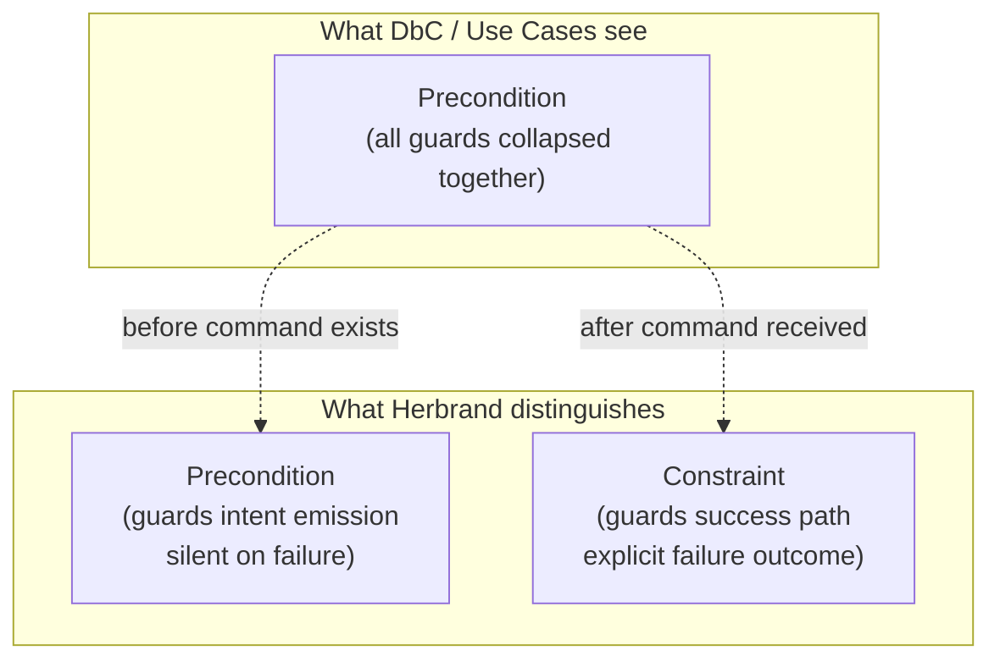

Business rules in Herbrand are partitioned into three categories: **preconditions**, **constraints**, and **outcome conditions**. Each category occupies a distinct position in the decision lifecycle and carries different semantics — *where rules are evaluated*, *what happens when they fail*, and *what authority they express*.

This partition is not arbitrary. It maps to well-established concepts in software architecture and business analysis, while drawing deliberate boundaries that those traditions typically leave blurred.

The choices, briefly:

1. **Preconditions guard intent, not operations** — aligned with UML guards, not DbC preconditions
2. **Constraints produce explicit, reactive failure outcomes** — elevating use case exception flows to first-class events
3. **Outcome conditions select among success signals** — not paths, but observable events with independent graph topology
4. **The unconditional outcome is structurally mandatory** — a completeness guarantee absent from prior frameworks

The naming departs from DbC convention where it would mislead, and preserves it where the semantics genuinely align. The rest of this section explains the reasoning behind each choice.

---

## The Three Categories



### Preconditions

Preconditions are evaluated by a **policy** before it decides whether to emit an intent. They represent the minimum coherence required for the intent to be meaningful at all. If any precondition is not met, the policy silently drops — no intent is emitted, no error is raised.

In the UI this translates to a disabled or hidden button. In an automation, it translates to a branch that simply does not trigger.

Preconditions characterise the rules for intent emission — their placement in the policy is a modelling choice, not an enforcement guarantee. In implementations where commands can arrive through channels that bypass the policy (direct API calls, service-to-service integrations, replayed events), the same rules may be re-stated as constraints on the operation for defensive depth. Doing so is valid and expected. The distinction between precondition and constraint is about *what the rule means* — not *where it is checked*.

```yaml
preconditions:
  - id: book-exists
    description: The requested book must exist in the catalog
    reads: [book.exists]

  - id: member-exists
    description: The requesting member must exist
    reads: [member.exists]
```

**Failure mode:** silent. The absence of an intent is not itself observable as an event.

### Constraints

Constraints are evaluated by an **operation** after it receives an intent. They guard the success path: if any constraint fails, the operation produces an `OperationFailed` outcome containing a list of the violated constraints. No state is modified. The failure outcome is a first-class observable event and may trigger downstream policies.

```yaml
constraints:
  - id: book-available
    description: Book must be available for lending
    reads: [book.available]

  - id: member-not-suspended
    description: Member must not be suspended
    reads: [member.suspended]

  - id: under-loan-limit
    description: Member must not have exceeded their loan limit
    reads: [member.active.loans, member.max.loans]
```

**Failure mode:** explicit. `OperationFailed` is an outcome like any other — it can activate policies, feed projections, and appear in decision tables.

### Outcome Conditions

When all constraints pass, at least one unconditional outcome is always produced. This is a structural guarantee: a constraint-passing operation must have an observable effect. Beyond this, additional conditional outcomes may be produced depending on state evaluated at execution time.

```yaml
unconditionalOutcome:
  kind: book.lent
  description: The book has been lent to the member
  effects:
    - point: book.available
      description: Set to false
    - point: member.active.loans
      description: Incremented by 1

conditionalOutcomes:
  - condition:
      description: Member reached their loan limit after this loan
      reads: [member.active.loans, member.max.loans]
    outcome:
      kind: member.loan.limit.reached
      description: Member has hit their borrowing limit
      effects: []
```

**Failure mode:** none. Outcome conditions select among success paths; they do not represent failures.

---

## Comparison Table

| Category | Evaluated by | Evaluated when | Failure mode | State effect on failure | Downstream trigger on failure |
|---|---|---|---|---|---|
| Precondition | Policy | Before intent emission | Silent drop | None | None |
| Constraint | Operation | After intent received | `OperationFailed` outcome | None | Yes — outcome is observable |
| Outcome condition | Operation | After constraints pass | N/A (selects among successes) | N/A | N/A |

A precondition rule may also appear as a constraint on the operation — same rule, different enforcement layer. This is a defensive implementation choice, not a modelling inconsistency.

---

## Relationship to Established Concepts

### BABOK

The *Business Analysis Body of Knowledge* (BABOK® Guide, IIBA, v3) is the profession's normative standard for business analysis practice. It does not specify an architectural model for business rules, but it establishes two reference points that align directly with Herbrand's structure.

**The policy/rule distinction.** BABOK defines a policy as a *non-actionable directive that supports a business goal*, and a business rule as a *specific, actionable, testable directive that supports a business policy*. This maps onto the Herbrand decision model without friction: a Herbrand policy decides whether to act — it is non-actionable in BABOK's sense, governed by preconditions — while a Herbrand operation executes a specific, testable directive, governed by constraints.

**The rule taxonomy.** BABOK inherits from the Business Rules Group a three-way classification of business rules:

| Business Rules Group category | Description | Herbrand equivalent |
|---|---|---|
| Structural assertion | Defines or constrains the structure of the domain (invariants) | Not modelled — emerges after behaviour is formalised |
| Action assertion | Constrains or triggers behaviour at execution time | Constraints (and, upstream, preconditions) |
| Derivation | Infers new facts from existing ones | Not modelled — depends on entities and views that are not yet defined |

This taxonomy runs on a different axis than Herbrand's. It also reflects a deliberate sequencing: both structural assertions and derivations depend on artefacts that Herbrand treats as outputs, not inputs. Structural assertions require a settled entity model — which in Herbrand emerges from what behavioural rules read and write. Derivations go further still: they require both entities *and* views to exist, so that data derivation pipelines can be assessed against a consolidated picture of what the system produces. Modelling either before behaviour is formalised would be premature — it would let an anticipated data model drive a behavioural design that does not yet exist. It classifies rules by *what they are about*; Herbrand classifies them by *when and how they are enforced*. The two are orthogonal — a rule that is an action assertion in BABOK terms may be a precondition or a constraint in Herbrand terms, depending on where in the decision lifecycle it is meaningful to evaluate it.

What BABOK does not specify — and what Herbrand formalises — is the enforcement architecture: where in a pipeline each category lives, what the failure mode is, and what the downstream consequences of failure are. BABOK's Business Rules Analysis technique is explicitly a *discovery and documentation* practice. Herbrand goes further in two ways: it turns documented rules into an enforceable, graph-connected model with defined failure semantics, and it enforces the natural emergence order of rule categories — behavioural rules first, structural assertions once entities exist, derivations once both entities and views are defined. This sequencing is not a convention; it is a structural constraint of the model, one that prevents premature definitions and the modelling errors that follow from them.

### Design by Contract (Meyer, 1992)

Bertrand Meyer's *Design by Contract* (DbC) is the canonical source of precondition/postcondition language in software engineering. DbC specifies three assertion types for a software component: preconditions (caller's obligation before invoking), postconditions (supplier's guarantee after returning), and invariants (class-wide consistency properties that hold at all observable states).

The Herbrand precondition is **not** a DbC precondition. In DbC, violating a precondition signals a programming error — the client called a routine incorrectly. In Herbrand, a failing precondition is a valid business state: the world is not ready for this intent, and that is fine.

### UML Guard Conditions

The semantics of Herbrand preconditions align more closely with **UML guard conditions** on state machine transitions. In UML, a guard is a Boolean expression evaluated when a trigger event occurs: if it evaluates to false, the transition does not fire — silently. This is precisely the policy's behaviour. The guard suppresses the transition (intent emission) without producing an error signal.

The parallel is deliberate. A policy models the decision of *whether to act*; guard conditions model the same thing in state machine terms.

### Use Case Preconditions and Flows (Cockburn, 2000)

Alistair Cockburn's *Writing Effective Use Cases* establishes the use case template widely used in business analysis. It includes:

- **Preconditions** — system state that must hold before the use case begins (documentation convention, not an enforcement mechanism)
- **Main success scenario** — the unconditional happy path
- **Extensions / alternative flows** — conditional deviations, including failures

Herbrand's structure maps to this template but formalises it as an architectural contract rather than a narrative convention:

| Cockburn | Herbrand |
|---|---|
| Preconditions (documented) | Preconditions (enforced at policy layer) |
| Exception flow (goal abandoned) | `OperationFailed` outcome (with violation list) |
| Main success scenario | Unconditional outcome |
| Alternative flow (goal still met) | Conditional outcome |

The key difference is that Herbrand elevates the exception flow to a first-class observable outcome — not just a narrative branch, but an event that can activate downstream policies, appear in projections, and be reasoned about in the graph.

### Business Rules and SBVR

The Object Management Group's *Semantics of Business Vocabulary and Rules* (SBVR) distinguishes between **structural rules** (invariants — always true) and **operative rules** (triggered at execution time). Herbrand constraints are operative rules in SBVR's terms: they fire when an intent arrives and produce a reaction.

Herbrand does not model invariants, and this is deliberate. SBVR structural rules are constraints on a vocabulary of concepts and their relationships — they cannot be written without a settled entity model to quantify over. In Herbrand, **the data model is not an input: it is an output.** Info points emerge from what preconditions read, what constraints check, and what outcomes modify. The entity structure is discovered through behaviour, not declared before it. Invariants — which assert properties across that structure at all times — can only be meaningfully specified once the behavioural model is complete and the shape of the data it requires is known. Establishing them prematurely would constrain a model that does not yet exist, or worse, let the anticipated data model drive the behavioural design in the wrong direction.

This sequencing is consistent with the EventStorming tradition (Brandolini), where aggregate boundaries — the natural home of invariants in DDD — are a late artefact of collaborative modelling, not a starting assumption. It is also consistent with formal methods practice: invariants in specification languages such as Z, Alloy, or TLA+ are properties proved *over* a defined state space, not prior to one.

The business rules community further distinguishes rules that *prohibit* (matching Herbrand constraints) from rules that *obligate* or *permit*. Herbrand does not attempt to cover the full SBVR taxonomy — it covers what is needed to derive exhaustive acceptance criteria from a decision model. Invariants belong to the validation phase that follows.

### The Two-Layer Split

The most significant structural choice Herbrand makes — and the one least represented in prior literature — is the **enforcement layer split** between preconditions (policy) and constraints (operation).

DbC collapses both into "preconditions" with optional defensive handling. Use case templates list both as documentation fields. BPMN models both as gateway conditions. None draw an explicit architectural boundary at the *intent emission point*.

Herbrand draws this boundary because it maps directly to the CQRS pattern: intents are commands, outcomes are events. The question of *whether a command should exist* (policy / preconditions) is separate from the question of *whether a received command can succeed* (operation / constraints). This separation has concrete consequences:

- **UI availability** is derived from preconditions, not constraints. A UI that shows a button whose command will always fail has a design defect.
- **Constraint violations are auditable**. Because `OperationFailed` is an outcome, it participates in the event stream and can be projected, counted, and reacted to.
- **Precondition failures are not auditable by design.** They represent absence of intent — there is nothing to record.

The split is a **modelling boundary**, not an enforcement exclusivity. A rule classified as a precondition describes a condition for intent coherence and is enforced at the policy layer. The same rule can additionally be enforced as a constraint at the operation layer — as a defensive measure against commands arriving through paths that bypass the policy entirely. What the split prohibits is the reverse: *a constraint cannot be "promoted" to a precondition to silence its failure.* If a business rule should produce a visible, auditable failure outcome, it belongs in the operation as a constraint, regardless of how convenient it would be to suppress it earlier.



---

## Why Outcome Conditions, Not Branching Logic

The term "outcome conditions" is chosen deliberately over "branching logic" or "alternative flows."

*Branching logic* implies a control-flow perspective: the process takes different *paths*. *Outcome conditions* describe what is actually modelled: an operation always produces its unconditional outcome, and may additionally produce one or more conditional outcomes depending on state. There is no branching — both the unconditional and conditional outcomes can be produced in the same execution.

This distinction matters for the graph model. In Herbrand, outcomes are nodes that other decisions can subscribe to. A conditional outcome is not a branch of the main outcome — it is a separate signal in the graph, with its own downstream subscribers. Calling it a "branch" would misrepresent its topology.

The structural guarantee — *at least one unconditional outcome must always exist when constraints pass* — ensures that every constraint-passing operation has an observable, stateful effect. This is a completeness property that flow-based notations do not enforce.
